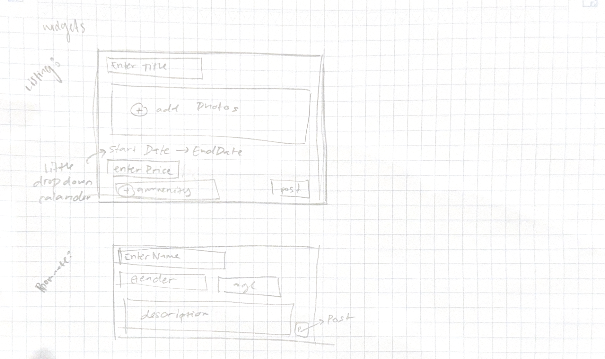
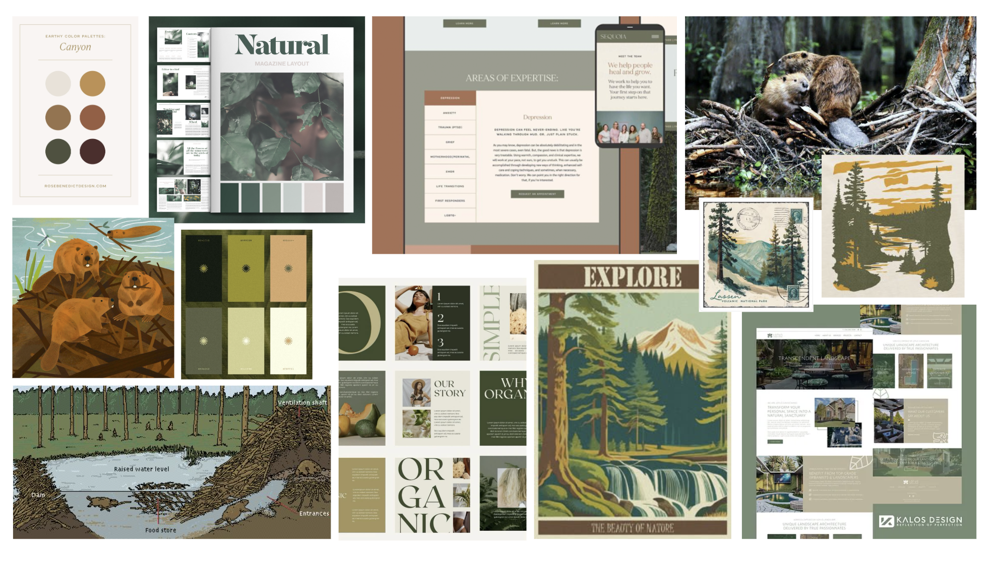

# Functional Design

## Problem Framing
Our only update from our [previous problem framing](./ProblemFraming.md) is that out [new problem framing](./UpdatedProblemFraming.md) removes the SSO from potential features to keep the project within scope and avoid overly complex features.

## Concept Design

Navigate to the following concepts:

- [UserInfo](../Concepts/UserInfoConcept.md)
- [UserAuthentication](../Concepts/PasswordAuth.md)
- [Reviewing](../Concepts/ReviewingConcept.md)
- [Listing](../Concepts/ListingConcept.md)
- [RoomatePosting](../Concepts/RoomatePosting.md)
- [Notification](../Concepts/NotificationConcept.md)
- [SavedItems](../Concepts/SavedItemsConcept.md)

## Syncs
Navigate to documentation of potential syncs using the above concepts
- [Syncs](Syncs.md)

## User Journey

Shannon is an MIT student who is planning to stay on campus over the summer to UROP. She knows that she wants to stay close to campus so her commute is easy, but also wants to be able to easily travel around the city to explore Boston during the summer. There are several places available to her, and she remembers seeing some students looking for roommates on Dormspam but can’t seem to find those emails again.

To get a better sense of her options, Shannon pulls up Dam Good Housing. She logs in with her MIT email, and updates her profile by putting in her place of work, Building 46. First going to the search results, she finds the number of locations a tad overwhelming. To help her think about the results more clearly, she filters the nearby results by her preferences: distance from work, proximity to a BlueBike station, and nearby food. A handful of results pop up this time, including fraternity housing on Beacon street, a summer sublet of 100 Mem, and staying in MacGregor. From the map of search results, she can see that there is a simple route to her work from 100 Mem and Macgregor, and a nice stroll across the bridge from the Beacon street housing.

Shannon has spent far too many late nights in MacGregor p-setting with her friends this semester, so she would prefer to get a change of scenery during her three months of freedom. As a result, she decides that looking for housing within the fraternity house and the apartment sublet would be best. Shannon realizes she needs to secure her financial situation before she can commit to housing for the summer, and goes to confirm her UROP position. To prevent losing progress, she saves the two listings she likes in her profile.

A few days later, Shannon comes back, and easily resumes her search through the saved items in her profile. While she was away, the fraternity decreased its housing rate, but she was not surprised since she received an email notifying her that the saved item had an update to its listing.

Ultimately, Shannon chooses the fraternity housing, and is satisfied how easy the process was to find summer housing in Boston.

## UI Sketches

## Visual Desgin Study

## Design Summary

Our design addresses two major friction points in the MIT summer housing search: finding short-term housing and identifying compatible MIT roommates in various cities. To solve these problems, our set of concepts work in parallel and support each other where the workflows overlap. For housing discovery, the **Listing** concept allows users to create and publish detailed summer housing posts that other students can browse. This is complemented by the **Reviewing** concept, which lets students rate or review housing they have previously lived in, giving prospective renters a clearer sense of housing quality, safety, and reliability. Additionally, the **Notification** concept alerts users whenever a listing they are following has a significant update, such as changes in availability, pricing, or new reviews, helping students track options without constantly rechecking the platform.

To address the second problem of finding potential MIT roommates, the **RoommatePosting** concept enables users to post information about themselves and browse potential roommates who will be living in the same city. This promotes community-building and supports students who want to live with other MIT students during the summer. Working alongside both **Listing** and **RoommatePosting**, the **SavedItems** concept allows users to save listings or roommate posts they want to revisit later, reducing search friction and making the process more organized and personalized.

Finally, the **UserInfo** and **UserAuthentication** concepts ensure that users can log in securely with their MIT credentials, access content safely, and trust that everyone on the platform is an MIT affiliate. This addresses key concerns raised in our ethics analysis regarding safety, privacy, and preventing misuse of housing-related information. While the overall design forms a coherent system, a few open questions remain regarding the exact data we should display for safety (e.g., precise addresses vs. approximate locations) and how reviews should be moderated to prevent misuse. Overall, the concepts collectively create a streamlined, community-centered, and secure solution to MIT students' summer housing challenges.

## Development Plan
| Feature                               | Lead       | Date   | Notes                                                                 |
|---------------------------------------|------------|--------|------------------------------------------------------------------------|
| Concept Specs Completed               | All, divided | 11/18 |                                                                        |
| Sync Specs Completed                  | Christina  | 11/18 |                                                                        |
| Database Initialization               |Camila| 11/19 | Startup MongoDB Database                                               |
| Concept Implementations (below)       |All, divided| 11/21 |                                                                        |
| UserConcept                           |Kailey| 11/21 |                                                                        |
| UserAuthConcept                       |Christina| 11/21 |                                                                        |
| ReviewingConcept                      |Kailey| 11/21 |                                                                        |
| RoomatePostingConcept                 |Meg| 11/21 |                                                                        |
| NotificationConcept                   |Camila| 11/21 |                                                                        |
| SavedItems/StatusItemsConcept         |Christina| 11/21 |                                                                        |
| API Spec for Backend                  |Kailey| 11/22 |                                                                        |
| Frontend Skeleton                     |All| 11/22 |                                                                        |
| **Checkpoint Alpha**                  |All| 11/25 | Should have completed: Concept Specs, Sync Specs, Concept Implementations, Sync Implementations, Backend Completed, Frontend Skeleton |
| Frontend Customization                |Camila, Meg| 11/26 | App-specific and visual-design specific components                     |
| Team Member Testing and Observations  |Individual| 11/26 | Follow variations of user journeys and edge cases, take notes of what works and what doesn’t. |
| Sync Implementation                   |All| 11/28 |                                                                        |
| Render Static Site Hosting            |Christina| 12/1  |                                                                        |
| **Checkpoint Beta**                   |All| 12/2  | Should have completed: A working application, reflects visual design study, maintained document of design choices/changes, correct server & notification updates, site hosted on public URL |
| Team Member Testing and Observations  |Individual| 12/3  | Follow variations of user journeys and edge cases, take notes of what works and what doesn’t. |
| **User Testing**                          |All| 12/7  |                                                                        |
| Team Member Testing and Observations  |Individual| 12/8  | Follow variations of user journeys and edge cases, take notes of what works and what doesn’t. |
| **Full Demo**                             |All| 12/9  |                                                                        |
| **Project Report**                    |All | 12/9  | Final versions: source code, design documents, concept specs, mentoring meeting records; additionally: design summary, individual reflections |

## Key Risks
- *User Authentication* - Ensuring a user is a member of the MIT community, or is in a known university, specifically for security reasons.
    - Mitigate: Begin by ensuring applicants can only sign up with an MIT email, and down the road attempt to require a Touchstone login.
    - Fallback: Ask users to go through a profile confirmation before being allowed to interact with postings or listings on the site, possibly including an image of a school id.
- *Race Conditions* - Ensuring listings are accurate, and that no two users can rent the same apartment at the same time.
    - Mitigate: Begin by ensuring real-time updates and the occasional automatic database refresh. Request that listings keep their posts updated.
    - Fallback: Keep the scope of this application to just connect users with listings, and notify posters to keep their listings updated.
